# MACD-IBG VIC Backtest

Repo này ứng dụng framework **MACD-IBG** cho cổ phiếu `VIC`.

Ý tưởng mô hình:

- **MACD** là alpha engine: trả lời câu hỏi có trend/directional alpha đáng giao dịch không.
- **Ito-Bayes-GARCH Defensive Exposure Model** là risk governor: trả lời nên cấp bao nhiêu vốn cho tín hiệu MACD trong điều kiện volatility, tail-risk và uncertainty hiện tại.
- Chỉ xét `long/cash`, không short-selling.
- Transaction cost mặc định: `0.05%` mỗi lần thay đổi position.

Dữ liệu VIC được tải bằng `vnstock`, daily OHLCV từ `2015-01-05` đến `2026-07-08`.

## Cách Chạy Lại

Tải dữ liệu VIC:

```bash
/home/namngyh/miniconda3/envs/eda/bin/python scripts/download_vic.py \
  --provider vnstock \
  --symbol VIC \
  --start 2015-01-01 \
  --output data/raw/VIC.csv
```

Chạy pipeline Ito-Bayes-GARCH, MACD và Buy & Hold:

```bash
/home/namngyh/miniconda3/envs/eda/bin/python stochastic_ito_bayes_garch_strategy.py \
  --data data/raw/VIC.csv \
  --output-dir outputs_vic_stochastic_calculus \
  --start-date 2015-01-01 \
  --train-ratio 0.70 \
  --transaction-cost 0.0005 \
  --risk-buffer 0.08 \
  --drift-window 126 \
  --drift-prior-strength 63 \
  --macd-fast 6 \
  --macd-slow 26 \
  --macd-signal 12 \
  --posterior-samples 600
```

Chạy tối ưu Ito/MACD baseline:

```bash
/home/namngyh/miniconda3/envs/eda/bin/python optimize_strategy_parameters.py \
  --data data/raw/VIC.csv \
  --output-dir outputs_vic_optimization \
  --start-date 2015-01-01 \
  --posterior-samples 300
```

Chạy stress-year:

```bash
/home/namngyh/miniconda3/envs/eda/bin/python stress_year_backtest.py \
  --base-dir outputs_vic_stochastic_calculus \
  --output-dir outputs_vic_stress_years \
  --top-years 5
```

Chạy hybrid MACD-IBG:

```bash
/home/namngyh/miniconda3/envs/eda/bin/python run_hybrid_experiment.py --config config.yaml
```

Chạy tối ưu hybrid risk governor:

```bash
/home/namngyh/miniconda3/envs/eda/bin/python optimize_hybrid_risk_governor.py --config config.yaml
```

## Dữ Liệu Và Split

Pipeline chính:

- Full data: `2015-01-06` đến `2026-07-08`, gồm `2,872` daily returns.
- Train: `2015-01-06` đến `2023-01-17`, gồm `2,010` quan sát.
- Test: `2023-01-18` đến `2026-07-08`, gồm `862` quan sát.

Optimizer baseline:

- Train: `2015-01-06` đến `2021-11-24`.
- Validation: `2021-11-25` đến `2024-03-15`.
- Test: `2024-03-18` đến `2026-07-08`.

## Kết Quả Pipeline Chính Trên Test

| Strategy | Total return | CAGR | Sharpe | Max drawdown | Nhận xét |
|---|---:|---:|---:|---:|---|
| Buy & Hold | 699.64% | 83.63% | 1.711 | -47.22% | Thắng raw return vì VIC tăng rất mạnh trong test. |
| MACD(6,26,12) | 381.16% | 58.29% | 1.652 | -27.10% | Giảm drawdown đáng kể so với Buy & Hold nhưng bỏ lỡ nhiều upside. |
| Ito-Bayes-GARCH | 321.00% | 52.23% | 1.548 | -33.12% | Có alpha/risk filter, nhưng vẫn không ăn trọn trend mạnh của VIC. |

Forecast:

- RMSE close: `2.685`.
- MAE close: `1.257`.
- R2 close: `0.9979`.
- Directional accuracy: `51.28%`.

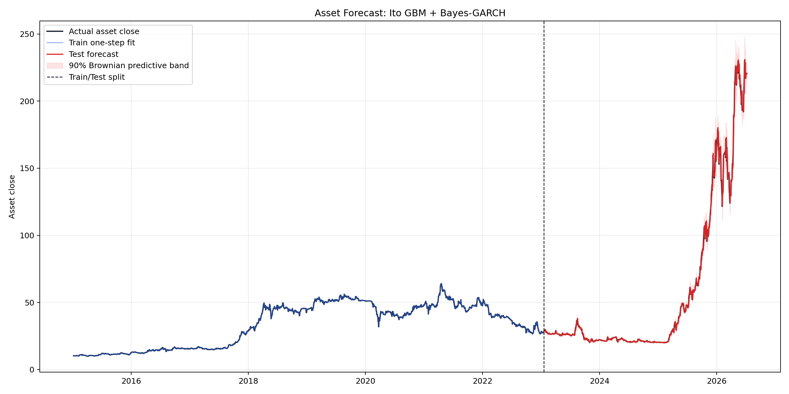

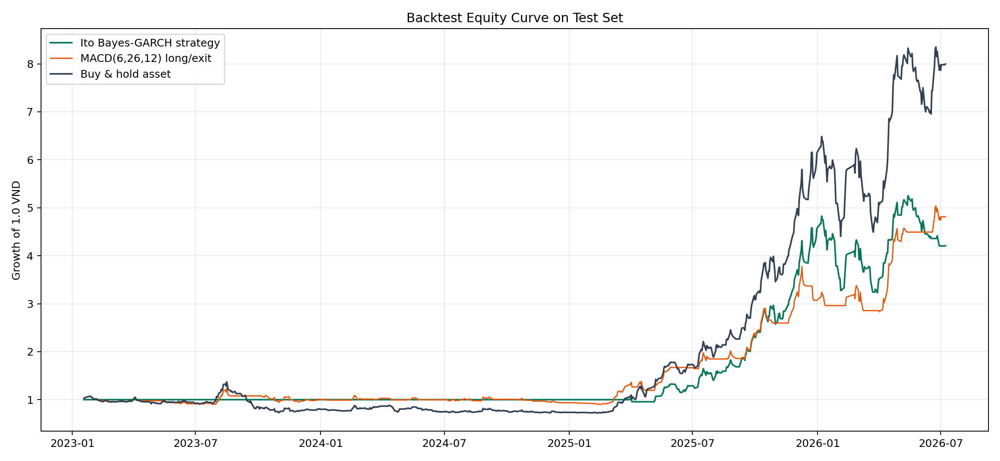

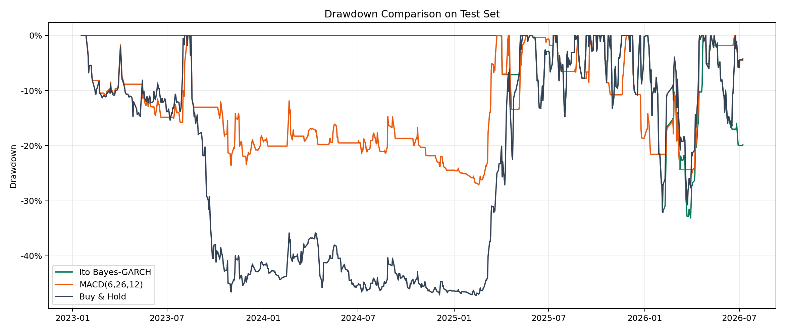

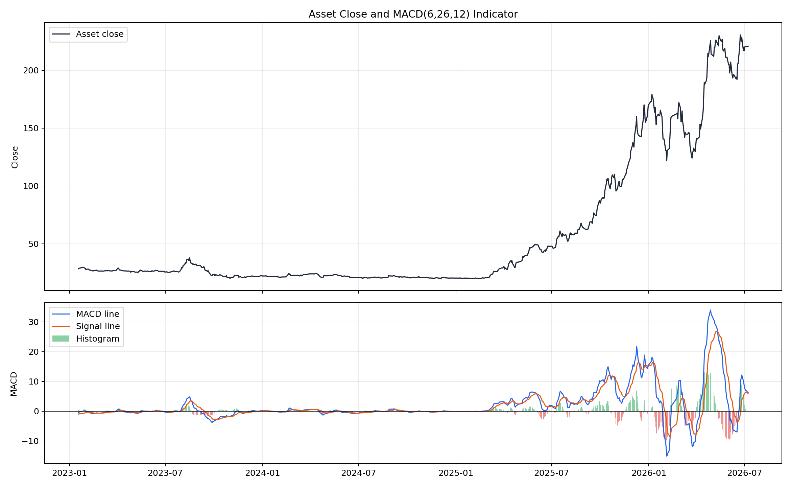

## Tối Ưu Ito/MACD Baseline

Best validation params:

| Model | Best params | Validation score |
|---|---|---:|
| Ito-Bayes-GARCH | `drift_window=63`, `prior_strength=126`, `risk_buffer=0.02` | 0.016 |
| MACD | `fast=8`, `slow=35`, `signal=7` | 0.068 |

Final test của optimizer:

| Strategy | Total return | CAGR | Sharpe | Sortino | Calmar | Max drawdown |
|---|---:|---:|---:|---:|---:|---:|
| Buy & Hold | 893.67% | 173.56% | 2.537 | 3.655 | 5.412 | -32.07% |
| Optimized Ito | 514.10% | 121.54% | 2.185 | 2.611 | 3.786 | -32.10% |
| Optimized MACD | 409.09% | 104.06% | 2.367 | 2.819 | 4.829 | -21.55% |
| Baseline MACD | 340.16% | 91.46% | 2.147 | 2.473 | 3.429 | -26.67% |

Kết luận baseline optimizer: VIC giai đoạn test có trend tăng rất mạnh, nên Buy & Hold vẫn thắng raw return và Calmar. MACD tối ưu có vai trò giảm drawdown từ `-32.07%` xuống `-21.55%`, nhưng đánh đổi bằng việc bỏ lỡ một phần lớn upside.

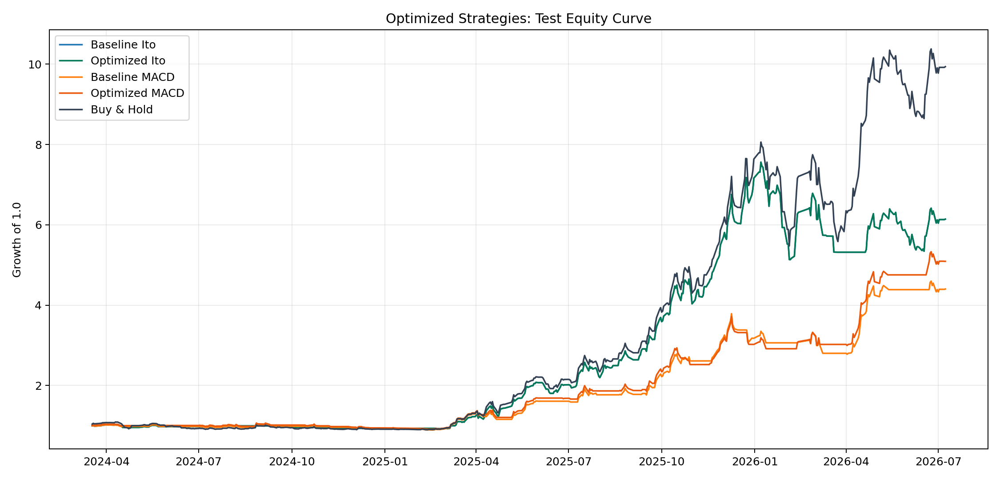

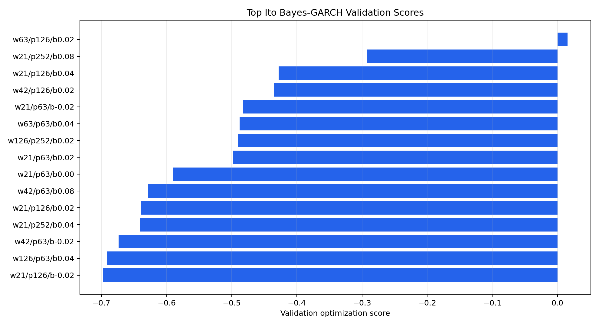

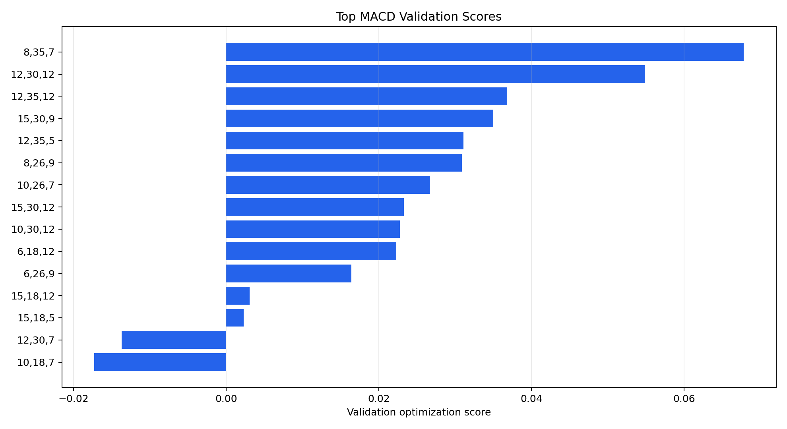

## Stress-Year Analysis

Các năm stress được chọn tự động: `2022`, `2023`, `2026`, `2020`, `2018`.

| Year | VIC return | Annual volatility | Max drawdown | Worst day |
|---|---:|---:|---:|---:|
| 2022 | -43.43% | 32.73% | -49.38% | -6.93% |
| 2023 | -17.10% | 33.35% | -46.56% | -7.00% |
| 2026 | 30.13% | 55.62% | -32.07% | -7.00% |
| 2020 | -5.91% | 32.40% | -37.99% | -6.98% |
| 2018 | 49.21% | 34.01% | -23.65% | -7.01% |

Điểm đáng chú ý:

- `2022` và `2023`: Ito-Bayes-GARCH đứng ngoài hoàn toàn, tránh được bear market của VIC.
- `2026`: MACD thắng mạnh, total return `56.68%`, tốt hơn Buy & Hold `30.13%`, vì bắt được pha trend tốt hơn.
- `2018`: Buy & Hold thắng raw return vì VIC tăng mạnh cả năm, nhưng vẫn chịu drawdown `-23.65%`.
- VIC có đặc thù biên độ lớn hơn VN-Index, nhiều phiên sát biên độ `-7%`, nên tail-risk gate và volatility targeting có giá trị giải thích rõ hơn.

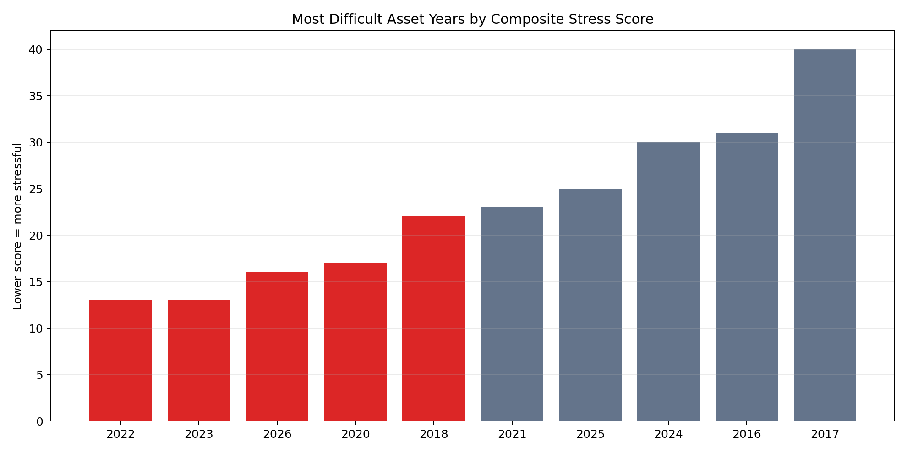

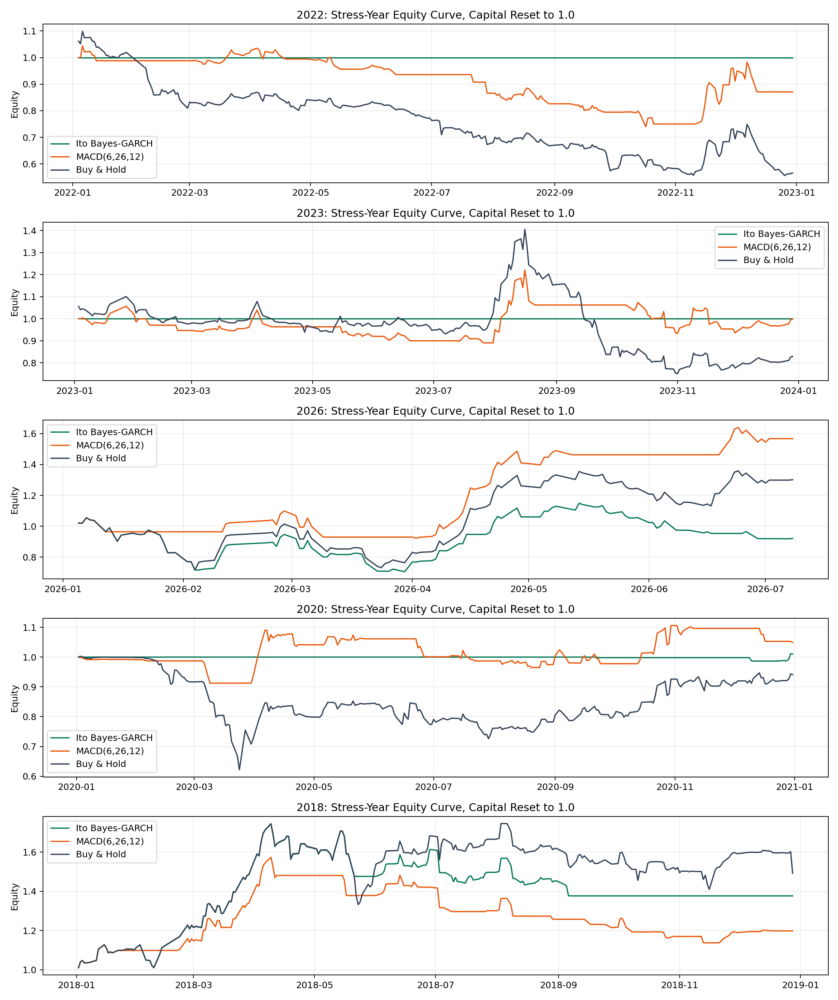

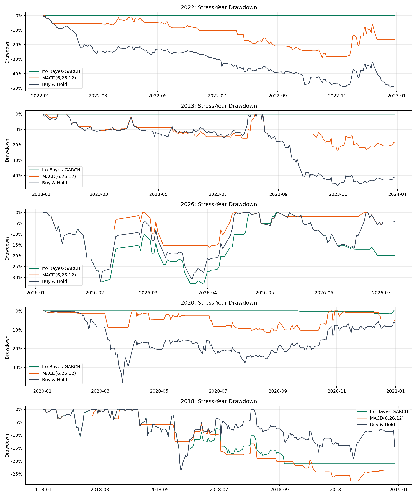

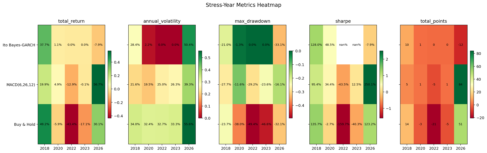

## Hybrid MACD-IBG Trên Full Sample

Hybrid mặc định giữ MACD(6,26,12) làm alpha engine và dùng IBG để điều chỉnh exposure.

| Strategy | Total return | CAGR | Sortino | Calmar | Max drawdown | Exposure |
|---|---:|---:|---:|---:|---:|---:|
| Buy & Hold | 1329.61% | 32.63% | 1.387 | 0.474 | -68.83% | 100.00% |
| MACD only | 824.37% | 26.63% | 1.185 | 0.756 | -35.23% | 51.52% |
| Ito-Bayes-GARCH only | 700.26% | 24.70% | 0.826 | 0.622 | -39.72% | 26.45% |
| MACD + volatility targeting | 96.74% | 7.45% | 0.992 | 0.385 | -19.33% | 22.03% |
| MACD + full defensive exposure | 9.96% | 1.01% | 0.213 | 0.228 | -4.44% | 3.35% |

Kết luận hybrid mặc định: full defensive exposure quá bảo thủ với VIC. Nó giữ drawdown rất thấp `-4.44%`, nhưng exposure chỉ `3.35%`, nên gần như không tận dụng được chu kỳ tăng mạnh của VIC.

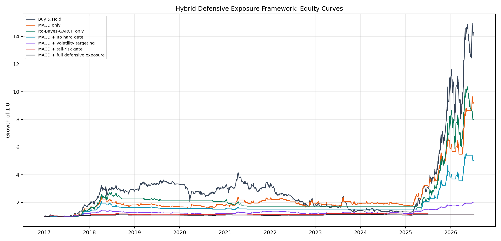

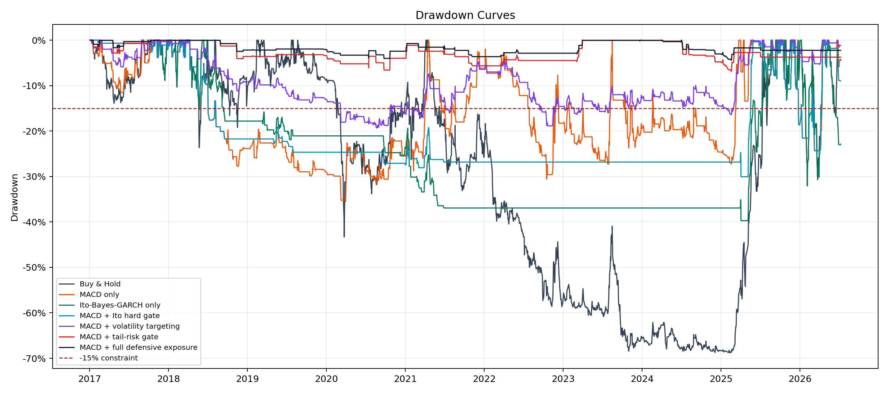

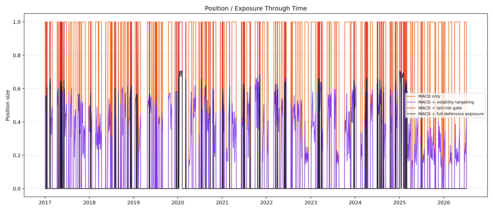

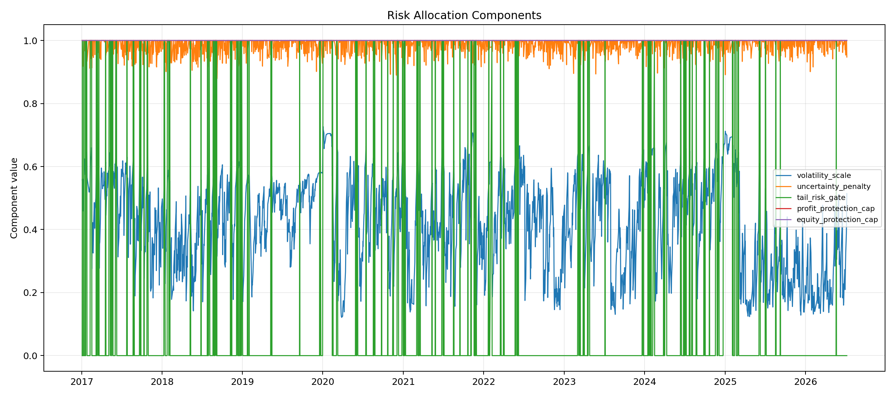

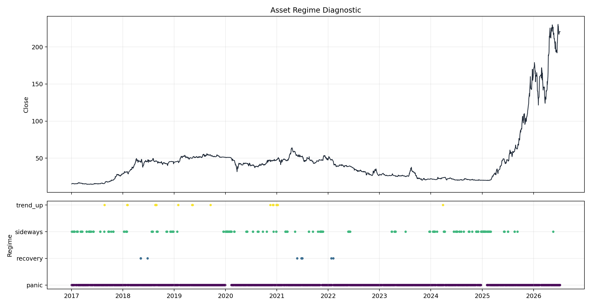

## Tối Ưu Hybrid Risk Governor

Best validation params:

| Parameter | Value |
|---|---:|
| target_volatility | 12.00% |
| loss_floor | -2.00% |
| uncertainty_penalty_k | 0.00 |
| profit_lock_threshold | 8.00% |
| warning_drawdown | 8.00% |
| danger_drawdown | 15.00% |

Final test sau tối ưu:

| Strategy | Total return | CAGR | Sortino | Calmar | Max drawdown | Exposure |
|---|---:|---:|---:|---:|---:|---:|
| Buy & Hold | 955.45% | 249.11% | 4.265 | 7.768 | -32.07% | 100.00% |
| MACD only | 377.47% | 129.19% | 2.983 | 5.177 | -24.96% | 53.05% |
| MACD + volatility targeting | 58.94% | 27.87% | 3.671 | 3.881 | -7.18% | 17.66% |
| MACD + full defensive exposure optimized | -0.22% | -0.12% | -0.033 | -0.048 | -2.47% | 3.44% |

Kết luận sau tối ưu hybrid: với VIC, risk governor cực kỳ phòng thủ và không phù hợp nếu mục tiêu là bắt trend tăng mạnh. Nó đạt drawdown constraint rất dễ (`-2.47%` so với ngưỡng `-15%`) nhưng hy sinh gần như toàn bộ upside. Nếu muốn dùng MACD-IBG cho VIC, phiên bản đáng nghiên cứu tiếp không phải full defensive hiện tại, mà là **MACD + volatility targeting** với target volatility cao hơn hoặc tail-risk gate nhẹ hơn.

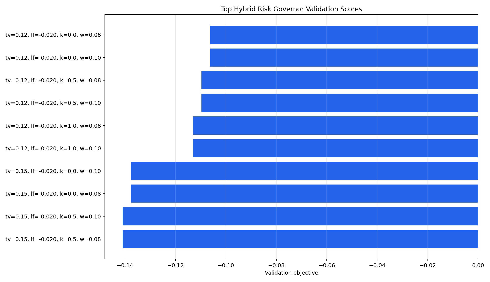

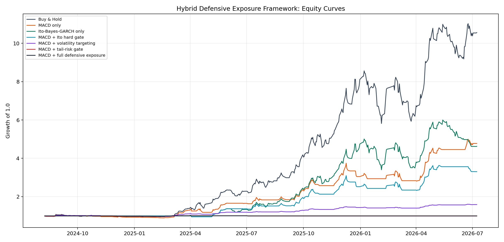

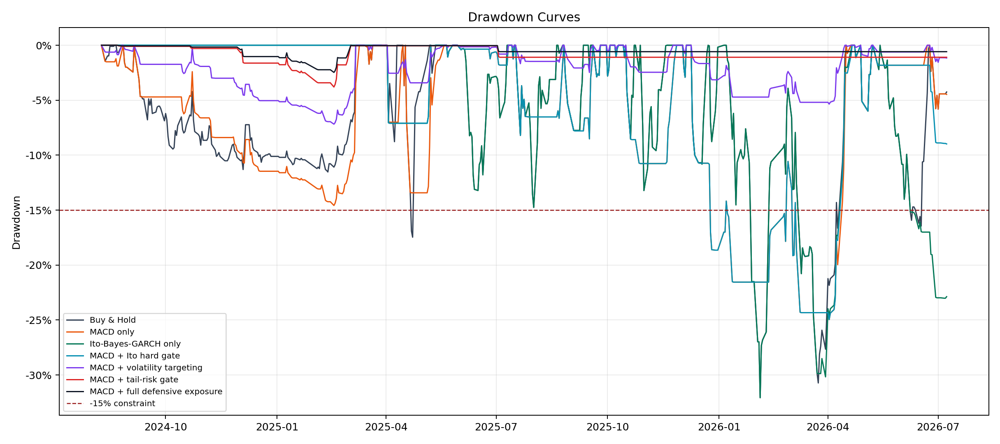

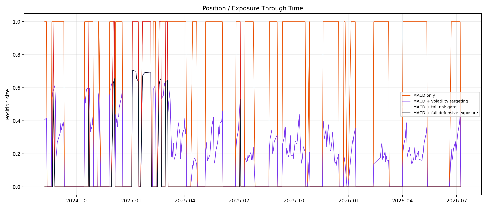

## Nhận Xét Chung

VIC khác VN-Index ở ba điểm lớn:

1. **Trend cổ phiếu đơn lẻ mạnh hơn chỉ số**: giai đoạn test của VIC có pha tăng rất lớn, đặc biệt sau 2024-2025. Buy & Hold thắng vì nắm trọn beta/idiosyncratic trend.
2. **Biên độ và tail-risk lớn hơn**: VIC có nhiều phiên giảm sâu quanh biên độ, khiến IBG risk governor nhận diện rủi ro rất mạnh và thường giảm exposure.
3. **Risk governor dễ quá bảo thủ**: cấu hình full defensive vốn phù hợp để giữ drawdown thấp lại làm mất quá nhiều upside ở cổ phiếu tăng nóng.

Trả lời câu hỏi mô hình có “tỏa sáng” hơn trên VIC không:

- **MACD alpha có hiệu quả hơn rõ rệt so với VN-Index**: MACD tạo return rất cao và giảm drawdown so với Buy & Hold.
- **Ito-Bayes-GARCH standalone cũng tốt hơn nhiều so với trên VN-Index**: test đạt `321%` trong pipeline chính.
- **MACD-IBG full defensive chưa tỏa sáng về return**: nó quá phòng thủ, exposure thấp, không bắt được rally lớn.
- **Giá trị chính của IBG trên VIC nằm ở stress control**: tránh được 2022/2023 rất tốt, giảm tail-risk tốt, nhưng cần nới risk allocation để không bỏ lỡ xu hướng.

Hướng phát triển tiếp theo:

- Tối ưu riêng target volatility cho cổ phiếu đơn lẻ, có thể thử `25%`, `35%`, `45%`.
- Làm tail-risk gate phụ thuộc regime: nới gate trong trend_up, siết gate trong panic.
- Thêm trailing exposure thay vì hard cash để tránh bỏ lỡ rally.
- Kiểm định riêng giai đoạn 2025-2026 vì đây là regime tăng bất thường của VIC.

Đây là research backtest, không phải khuyến nghị đầu tư.
